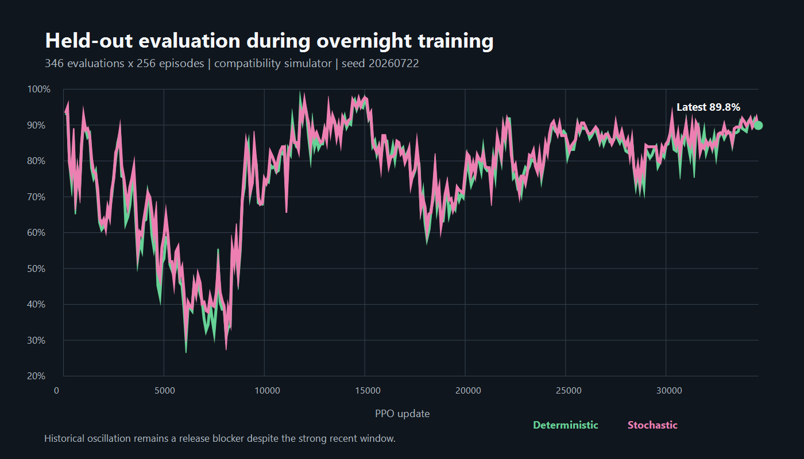
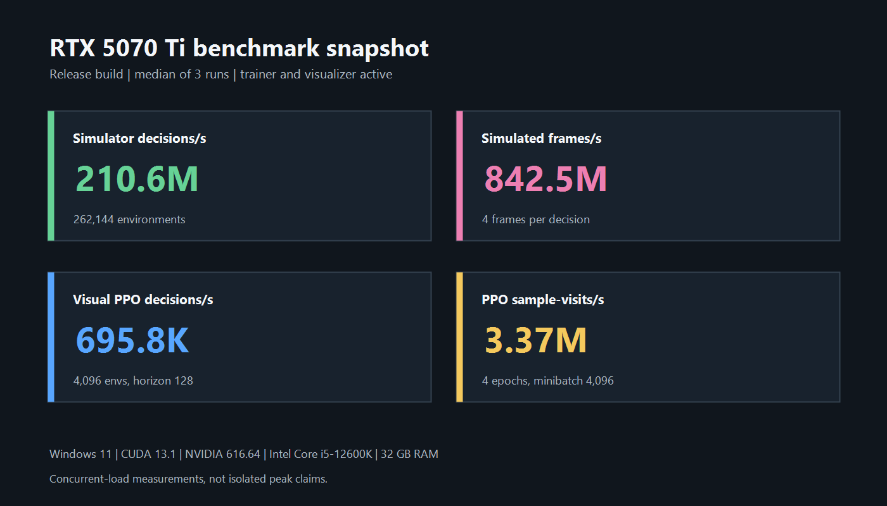

# Tekken 8 Agent V3

A CUDA-first reinforcement-learning project for training character-aware fighting-game policies,
validating them in a deterministic simulator, and testing them against Tekken 8 through screen
capture and virtual-controller output.

> [!WARNING]
> **V3 is unfinished experimental software and is under active development.** The compatibility
> trainer runs at scale, but the full-move engine, character gates, real-game validation, and live
> deployment path are not complete. No current checkpoint should be described as a finished
> Tekken 8 bot.

> [!IMPORTANT]
> This project does not read Tekken 8 memory, modify the game, or reproduce the complete game
> engine. Training uses an independent Tekken-like simulator. Live play uses only screen-derived
> observations and controller inputs, and must be tested in offline modes where automation is
> permitted.

## Project status

V3 introduces the data and policy architecture needed to move beyond a fixed six-attack action
space:

- 6,393 documented move rows compiled across 41 sourced fighters;
- stable character-specific move IDs and a versioned move-catalog contract;
- 18 universal movement and defense actions plus variable per-character move candidates;
- a CUDA parametric PPO policy that scores legal move-property vectors;
- legal-action masks for recovery, posture, stance, Heat, Rage, and character resources;
- a scalar combat oracle for launches, combos, scaling, tornado, walls, armor, crushes, parries,
  throws, recoverable health, Heat, and Rage;
- deterministic command execution for motions, chords, holds, releases, strings, stance inputs,
  just-frame separators, and facing conversion;
- strict per-character validation reports and offline Practice-mode command checks;
- screen-based live inference with capture freshness checks, persistent guard/movement holds,
  cancellable action sequences, and round-history reset.

The full-move path is deliberately gated. Imported frame data does not contain every measurement
needed to model collision, tracking, active frames, transitions, or character mechanics exactly.
A fighter is not enabled for full-move training until its data, CPU scenarios, CUDA parity,
representative combo routes, and offline Practice validation all pass.

The current native trainer still provides a compatibility rollout path using six combat slots per
character. It is useful for PPO, self-play, scheduling, evaluation, and throughput work, but it is
not presented as complete full-moveset Tekken training.

## Architecture

```text
documented move data              screen capture
          |                             |
          v                             v
 versioned move compiler        observable-state estimator
          |                             |
          v                             |
character move candidates              |
          |                             |
          +----------+------------------+
                     v
          shared state encoder
                     |
          parametric move scorer
                     |
                     v
             legal move/action
                     |
          +----------+-----------+
          |                      |
          v                      v
   CUDA simulation      controller command executor
          |                      |
          v                      v
 PPO + self-play             Tekken 8 offline
```

The value function is state-only. The policy builds a state query, compares it with each legal
candidate's encoded properties, and samples only from the current fighter's valid candidates.
Checkpoint metadata binds a policy to its roster version, move-catalog hash, observation contract,
action contract, and feature dimensions.

## Repository map

| Path | Purpose |
|---|---|
| `src/train.cpp` | Native PPO training, evaluation, self-play, checkpointing, and exact resume |
| `src/ppo.cu` | CUDA actor-critic, parametric move scoring, GAE, PPO, and Adam |
| `src/gpu_sim.cu` | Batched compatibility simulator used for rollout collection |
| `src/full_combat.cpp` | Scalar full-combat correctness oracle |
| `src/opponents.cu` | Scripted profiles and checkpoint-opponent routing |
| `src/temporal.cu` | Character and temporal observation encoding |
| `src/t8_agent/moves/` | Move compiler, notation parser, masks, and validation gates |
| `src/t8_agent/live/` | Checkpoint loading and screen-observable live policy runtime |
| `src/t8_agent/io/` | Screen capture and virtual-controller backends |
| `data/characters/` | Saved character move sources and provenance |
| `data/generated/` | Compiled catalogs, reports, profiles, and hashes |
| `scripts/` | Training, visualization, calibration, validation, and live-play entry points |
| `tests/` | CPU, CUDA, PPO, resume, catalog, controller, vision, and runtime tests |

## Requirements

Core native training:

- Windows 10 or 11
- NVIDIA GPU
- CUDA Toolkit 13.1 or a compatible toolkit
- Visual Studio 2022 with Desktop development with C++
- CMake 3.24 or newer
- Python 3.10 or newer

Live testing additionally requires DXcam, OpenCV, `keyboard`, `vgamepad`, and a functioning
ViGEmBus installation. Live dependencies are not required for simulator training.

## Build

For an RTX 5070 Ti or another Blackwell GPU using architecture 120:

```powershell
cmake -S . -B build -A x64 -DCMAKE_CUDA_ARCHITECTURES=120
cmake --build build --config Release --parallel
```

For another GPU, omit `-DCMAKE_CUDA_ARCHITECTURES=120` to use the repository defaults or provide
the architecture matching that device.

Install the Python development environment:

```powershell
python -m pip install -e ".[dev]"
```

## Test

```powershell
ctest --test-dir build -C Release --output-on-failure
python -m pytest tests -q
```

The native suite covers scalar behavior, CUDA parity, policy inference, PPO updates, exact resume,
catalog loading, full-combat mechanics, and headless visualization. The Python suite covers move
compilation, legality rules, live checkpoint loading, screen freshness, controller cancellation,
runtime state, roster scheduling, and optional vision components.

## Move catalog

Rebuild the saved roster and compiled catalogs:

```powershell
python tools\import_roster_frame_data.py --allow-missing
python tools\generate_opponent_catalog.py --data-root data
python tools\compile_full_move_catalog.py
```

Expected generated totals:

| Item | Count |
|---|---:|
| Roster records | 42 |
| Fighters with sourced move data | 41 |
| Documented move rows | 6,393 |
| Opponent profiles | 2,100 |
| Universal actions | 18 |

Bob remains explicitly unavailable because the saved source snapshot has no move endpoint. No
generic substitute is generated. Roger Jr. is not treated as a playable fighter until released,
documented data is available, and the same validation gates pass.

Inspect a fighter's gate status:

```powershell
python tools\check_character_gate.py jun
python scripts\validate_move_commands.py jun --dry-run
```

Missing or contradictory fields remain visible and block promotion. They are never silently
replaced with generic attack properties.

## Offline move validation

With Tekken 8 open in Practice mode and its input-history display visible:

```powershell
python scripts\validate_move_commands.py jun --confirm-offline
```

The validator walks through compiled commands and records results under `data/validation/`:

- `F8`: pass
- `F9`: fail
- `F10`: skip
- `Esc`: stop safely

Validation records are written atomically. A parsed command is not automatically considered a
correct in-game command.

## Training

Run a short compatibility smoke test:

```powershell
build\Release\t8_v2_train.exe --smoke `
  --opponents roster `
  --learner-character jun `
  --observation-mode visual `
  --reward shaped `
  --seed 2027 `
  --run-dir runs\smoke_jun_2027
```

Start a larger run and launch the checkpoint-following visualizer:

```powershell
powershell -NoProfile -ExecutionPolicy Bypass `
  -File scripts\start_full_training.ps1 `
  -RunDir runs\jun_visual_2027 `
  -Seed 2027
```

Equivalent native command:

```powershell
build\Release\t8_v2_train.exe `
  --envs 4096 `
  --horizon 128 `
  --updates 100 `
  --curriculum-updates 100 `
  --epochs 4 `
  --minibatch 4096 `
  --opponents roster `
  --learner-character jun `
  --full-move-catalog data\generated\full_move_catalog.csv `
  --curriculum-stage auto `
  --observation-mode visual `
  --reward shaped `
  --seed 2027 `
  --run-dir runs\jun_visual_2027
```

`--learner-character all` remains blocked until at least one complete full-move character passes
measured CPU/CUDA parity and Practice validation. This prevents a compatibility run from being
mistaken for full-roster move training.

### Self-play and evaluation

The final curriculum stage uses frozen policy checkpoints as opponents:

- 80% latest-self checkpoint;
- 20% strongest older checkpoint selected by held-out evaluation.

Training balances the learner across P1 and P2. Held-out profiles are separate from training
matchmaking and do not change the training scheduler. Metrics include reward, win/draw/loss rates,
matchup results, behavior statistics, Elo, and forgetting checks.

### Measured training snapshot

The following snapshot was captured at update 7,000 on 2026-09-20 from the active compatibility run
`overnight_roster_visual_shaped_seed20260722`. It used 32,768 environments, a horizon of 128,
four PPO epochs, a 131,072-sample minibatch, visual observations, shaped rewards, and the roster
opponent curriculum.

| Measurement | Result |
|---|---:|
| Completed PPO updates | 7,000 |
| Environment decisions | 29,360,128,000 |
| Trainer elapsed time | 4:09:55 |
| End-to-end run throughput | 1,957,943 decisions/s |
| Atomic policy/state checkpoint pairs | 70 |
| Saved held-out evaluations | 70 x 256 episodes |
| Mean deterministic held-out win rate | 63.1% |
| Deterministic held-out range | 30.5% to 93.4% |
| Last-10 deterministic evaluation mean | 40.2% |
| Latest deterministic/stochastic win rate | 35.9% / 40.6% |
| Latest P1/P2 deterministic win rate | 46.9% / 25.0% |
| Latest approximate KL / clip fraction | 0.00061 / 0.0067 |
| Latest value loss | 0.00056 |
| Trainer stderr | Empty |



At this point the run was actively using 80% latest-self and 20% best-older checkpoint opponents.
The process remained stable and error-free, but held-out performance regressed substantially and
the P1/P2 split is too large. This demonstrates that the training pipeline executes at scale; it
does **not** demonstrate that learning quality is solved. Self-play regression, side robustness,
and checkpoint promotion are explicit release blockers below.

### Resume

Use the same run-defining options and pass both the existing run directory and checkpoint:

```powershell
build\Release\t8_v2_train.exe `
  --envs 4096 `
  --horizon 128 `
  --updates 200 `
  --curriculum-updates 100 `
  --epochs 4 `
  --minibatch 4096 `
  --opponents roster `
  --learner-character jun `
  --full-move-catalog data\generated\full_move_catalog.csv `
  --curriculum-stage auto `
  --observation-mode visual `
  --reward shaped `
  --seed 2027 `
  --run-dir runs\jun_visual_2027 `
  --resume runs\jun_visual_2027\checkpoints\update_100.t8ppo
```

Checkpoint format v3 rejects policies from the previous fixed-action contract with an explicit
incompatibility error. Exact resume also validates trainer options, catalog identity, roster
version, learner character, scheduler state, simulation state, and random-number state.

## Visualizer

Watch a standalone CUDA matchup:

```powershell
.\.venv\Scripts\python.exe scripts\visualize_v2.py `
  --opponent-character reina `
  --opponent-archetype rushdown
```

Follow the newest checkpoint from a training run:

```powershell
.\.venv\Scripts\python.exe scripts\visualize_v2.py `
  --follow-dir runs\jun_visual_2027\checkpoints `
  --observation-mode visual `
  --opponent-character reina `
  --opponent-archetype rushdown
```

The visualizer runs a separate CUDA evaluation feed and does not slow the trainer's rollout path.

## Live offline testing

Install the optional live dependencies and verify the environment:

```powershell
python -m pip install -e ".[live]"
python scripts\calibrate_live_screen.py --automatic
python scripts\check_live_setup.py
```

Begin with controller output disabled:

```powershell
python scripts\live_vision_play.py --dry-run --agent v2 `
  --ppo-checkpoint runs\jun_visual_2027\checkpoints\update_100.t8ppo `
  --player 1 `
  --opponent-character reina `
  --opponent-archetype movement_specialist
```

Controls:

- `F8`: enable or pause controller output
- `F7`: reverse facing after a side switch
- `F6`: manually reset policy and perception history

The live runtime pauses output when fresh capture frames stop arriving. Movement and guard are held
persistently between decisions, attack sequences are cancellable, and new rounds reset temporal
history. Start in Practice mode, verify the capture regions and facing, and keep the emergency pause
hotkey reachable.

## Benchmarks

Benchmark commands:

```powershell
build\Release\t8_v2_gpu_benchmark.exe --envs 262144 --steps 2000
build\Release\t8_v2_training_benchmark.exe `
  --envs 4096 --horizon 128 --updates 5 --minibatch 4096 --epochs 4 --visual
```

Measured on 2026-09-20 with an NVIDIA GeForce RTX 5070 Ti 16 GB, an Intel Core i5-12600K,
32 GB system memory, Windows 11 build 26200, NVIDIA driver 616.64, and CUDA 13.1. Each result is
the median of three runs from the Release build. The overnight trainer and visualizer remained
active, so these are concurrent-load measurements rather than isolated peak claims.

| Benchmark | Median result |
|---|---:|
| Simulator-only environment decisions/s | 210,617,647 |
| Simulator-only simulated frames/s | 842,470,589 |
| Visual rollout + PPO environment decisions/s | 695,790 |
| PPO sample-visits/s | 3,367,558 |
| Five-update end-to-end time | 3.77 s |



The three simulator-only runs ranged from 208.9M to 215.6M decisions/s. The three end-to-end
visual PPO runs ranged from 670K to 705K decisions/s. Performance depends on batch size, GPU,
CUDA build, observation contract, opponent mix, and concurrent GPU load; record the exact commit
and command alongside new measurements.

Regenerate both README figures from a saved run with:

```powershell
powershell -NoProfile -ExecutionPolicy Bypass `
  -File tools\render_readme_figures.ps1 -MaxUpdate 7000
```

## Documentation

- [Full-roster architecture](docs/full_roster_move_architecture.md)
- [Roster curriculum](docs/roster_curriculum.md)
- [Training and evaluation](docs/training.md)
- [CUDA visualizer](docs/visualizer.md)
- [Live runtime](docs/live_runtime.md)
- [Roadmap](docs/roadmap.md)
- [Frame-data provenance](data/README.md)

## Roadmap and TODO

None of the 42 roster records currently passes the full character gate. The sourced catalog has
6,393 move rows, with 254 commands still requiring parser review, two known inconsistent source
frame records, and no sourced fighter yet carrying the complete measured physics and Practice-mode
validation required for promotion.

### Immediate training blockers

- [ ] Diagnose the held-out regression from a 93.4% peak to 35.9% at update 7,000.
- [ ] Fix the 46.9% P1 versus 25.0% P2 evaluation gap and add a side-gap promotion threshold.
- [ ] Audit latest-self opponent loading, frozen recurrent history, side routing, and reset state.
- [ ] Re-evaluate why checkpoint 100 remains the best older opponent after 70 evaluations.
- [ ] Add automatic rollback or pause when held-out score, exploitability, or side balance regresses.
- [ ] Fix `matchup_matrix.json`, which currently remains at zero episodes despite completed evals.
- [ ] Export evaluation curves and per-style/per-character results directly, rather than recovering
  the summary from nested metric records and console logs.
- [ ] Run isolated benchmarks with the trainer stopped and record power, memory, and repeatability.
- [ ] Repeat long training across at least five seeds before making learning-quality claims.

### Move data and validation

- [ ] Resolve all 254 unparsed or ambiguous command notations without generic substitutions.
- [ ] Resolve the known Jun and Miary Zo frame-data inconsistencies against current-patch evidence.
- [ ] Measure active frames, range, pushback, collision, axis behavior, and tracking for every move.
- [ ] Record exact stance transitions, cancels, counter-hit properties, resource effects, armor,
  crush, parry, reversal, throw, Heat, Rage, and recoverable-health behavior.
- [ ] Add patch identity, retrieval date, provenance, confidence, and reviewer status to every
  manually measured field.
- [ ] Complete offline input-history validation for all 6,393 sourced commands.
- [ ] Collect and validate Bob's move table manually if no reusable current source appears.
- [ ] Keep Roger Jr. disabled until the fighter is released and validated data exists.
- [ ] Add a patch-update workflow that diffs move changes and invalidates affected validations.

### Full-move combat engine

- [ ] Bind validated Jun catalog records to the scalar full-combat oracle.
- [ ] Implement exact hitboxes/ranges, active windows, movement, axis, collision, and pushback.
- [ ] Finish grounded, airborne, knockdown, wake-up, wall, floor, balcony, and stage-transition rules.
- [ ] Finish exact launch, float, tornado, combo scaling, wall scaling, recoverable health, Heat,
  Heat Dash/Smash, Rage, armor, crush, parry, reversal, throw, and throw-break behavior.
- [ ] Add character-specific stance and resource state machines, beginning with GEN, IZU, and MIA.
- [ ] Add curated midscreen, wall, Heat, and counter-hit routes with legal execution assertions.
- [ ] Mirror the validated scalar engine in CUDA and run randomized parity over every legal move.
- [ ] Replace the six-slot compatibility rollout with variable full-move candidates on both sides.
- [ ] Apply dynamic legal masks on GPU for stance, posture, resources, recovery, Heat, Rage, and
  combo state without silent no-op actions.
- [ ] Rebenchmark memory use and throughput at the 330-candidate upper bound.

### Character rollout

- [ ] Complete Jun as the vertical slice with all 149 documented moves and validated routes.
- [ ] Add mechanic representatives: Kazuya, King, Hwoarang, Xiaoyu, Alisa, Yoshimitsu, and Clive.
- [ ] Add the remaining fighters in roster order: Jin, Paul, Law, Jack-8, Lars, Nina, Leroy, Asuka,
  Lili, Bryan, Claudio, Azucena, Raven, Leo, Steve, Kuma, Shaheen, Dragunov, Feng, Panda, Lee,
  Zafina, Devil Jin, Victor, Reina, Eddy, Lidia, Heihachi, Anna, Fahkumram, Armor King, Miary Zo,
  Kunimitsu, and Bob.
- [ ] Enable each fighter for learner sampling, scripted curriculum, matchup evaluation, and
  checkpoint self-play only after its complete gate passes.
- [ ] Run a full-roster smoke test with every enabled fighter on P1 and P2 and no NaNs or invalid
  memory access.

### PPO, curriculum, and evaluation

- [ ] Make the parametric move scorer the production rollout policy after Jun parity passes.
- [ ] Train only from screen-observable features plus calibrated uncertainty, with no hidden move ID.
- [ ] Add movement, punishment, throw-break, launch, carry, tornado, wall, wake-up, Heat, Rage, and
  matchup scenario curricula without adding exploitable reward shaping.
- [ ] Validate observation and return normalization for the native PPO pipeline.
- [ ] Balance character, archetype, scenario, and side sampling across training.
- [ ] Evaluate actual policy checkpoints head-to-head and rank the checkpoint pool with fixed,
  reproducible Elo or another documented draw-aware score.
- [ ] Sample opponents by comparable skill while retaining recent and diverse historical policies.
- [ ] Add exploit policies, regression opponents, and catastrophic-forgetting promotion gates.
- [ ] Validate exact resume after the full-move simulator, candidate masks, and league state land.
- [ ] Add statistical reports for confidence intervals, side/style robustness, and multi-seed AUC.

### Live offline deployment

- [ ] Require and verify the controlled character before loading a full-move checkpoint.
- [ ] Connect stable move IDs from parametric inference to compiled controller sequences.
- [ ] Replace generic live attack labels with an explicit unknown/uncertain observable state or a
  validated move-family recognizer.
- [ ] Estimate live recovery, posture, stance, Heat, Rage, resources, combo state, and legal actions.
- [ ] Add execution feedback for accepted, interrupted, whiffed, blocked, and failed commands.
- [ ] Automatically detect facing changes and round boundaries, retaining manual safety overrides.
- [ ] Validate every command's timing, cancellation, charge, release, chord, just-frame, and stance
  transition in offline Practice mode.
- [ ] Add end-to-end replay capture and comparison between expected and observed controller results.
- [ ] Validate fresh-frame failsafes, emergency pause, and controller release under sustained runs.
- [ ] Test representative full rounds in Practice and local versus modes before broader use.

### Visualization and project quality

- [ ] Show full move names/IDs, legal masks, stance/resources, Heat/Rage, combo state, uncertainty,
  checkpoint identity, and self-play opponent source in the visualizer.
- [ ] Add live reward, evaluation, side-gap, entropy, KL, and throughput plots to run artifacts.
- [ ] Add Windows CPU-only compile checks plus CUDA build, sanitizer, parity, and resume CI coverage.
- [ ] Add schema migration tests and catalog-hash compatibility fixtures for future game patches.
- [ ] Document data reuse rights, manual validation provenance, supported hardware, and release steps.
- [ ] Produce a reproducible V3 acceptance report before marking the architecture complete.

### Later: Linux support

- [ ] Add supported Linux builds for the native CUDA simulator, PPO trainer, tests, and benchmarks.
- [ ] Replace Windows-only PowerShell and batch launchers with cross-platform orchestration.
- [ ] Add Linux CI for compiler, CUDA, catalog, and checkpoint-contract coverage.
- [ ] Investigate Linux screen capture and virtual-controller support after native training is
  portable; the current live runtime depends on Windows-specific DXcam and ViGEm components.

## Scope and safety

- Use controller automation only in offline modes or where it is explicitly allowed.
- Do not treat simulator win rate as proof of real-game strength.
- Keep unmeasured mechanics marked unknown until verified against the current game patch.
- Tekken and its characters are property of their respective owners. This is an independent
  research project and is not affiliated with Bandai Namco Entertainment.
